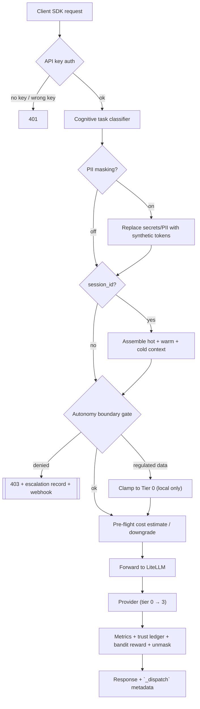

# DISPATCH

<div align="center">

**An open-source LLM gateway that routes every request to the cheapest capable backend — and makes it impossible for regulated data to leave your own hardware.**

[](https://github.com/hoomanp/dispatch/actions/workflows/ci.yml)
[](LICENSE)
[](https://www.python.org/)
[](https://fastapi.tiangolo.com)
[](docker-compose.yml)

</div>

---

## Contents

- [What it is](#what-it-is)
- [How it works](#how-it-works)
- [Features](#features)
- [Quick start](#quick-start)
- [Configuration](#configuration)
- [Client integration](#client-integration)
- [API reference](#api-reference)
- [Observability](#observability)
- [Evaluation harness](#evaluation-harness)
- [Development & testing](#development--testing)
- [Repository layout](#repository-layout)
- [Roadmap](#roadmap)
- [Known limitations](#known-limitations)
- [License](#license)

---

## What it is

DISPATCH sits between your applications and your inference backends as a
**control plane + data plane** pair:

* **DISPATCH gateway (FastAPI, `:8080`)** decides *whether* a request may run
  and *where* — task classification, budget gating, data-classification tier
  ceilings, per-agent rate limits, memory/context assembly, cost pre-flight,
  audit stamping.
* **LiteLLM proxy (`:4000`)** executes it — providers, connection pooling,
  retries, cooldowns, fallback chains, prompt caching and spend accounting.

Clients keep speaking the wire formats they already use (OpenAI, Anthropic,
Gemini). Point `base_url` at DISPATCH and nothing else changes.

The design rule, documented in [docs/ARCHITECTURE.md](docs/ARCHITECTURE.md):
*if a feature can be expressed as LiteLLM config, it belongs in LiteLLM —
DISPATCH only owns routing, policy and context.*

**Why:** frontier models are expensive, cloud egress of regulated data is a
compliance risk, and autonomous agents need a blast radius. DISPATCH answers
all three with one choke point: every request passes `AutonomyBoundary.evaluate()`
before any provider is reached.

---

## How it works

```
┌───────────────────────────────────────────────────────────────────────────────┐
│                 Clients: OpenAI SDK · Anthropic SDK · Gemini SDK · MCP        │
└──────────────────────────────────────┬────────────────────────────────────────┘
                                       │ HTTP
                                       ▼
┌───────────────────────────────────────────────────────────────────────────────┐
│                     DISPATCH GATEWAY & CONTROL PLANE (:8080)                  │
│                                                                               │
│   auth ─ rate limit ─ classify ─ mask PII ─ assemble context ─ budget gate    │
│                       ─ clamp to classification ceiling                       │
│                       ─ pre-flight cost estimate ─ boundary decision + audit  │
└──────────────────────────────────────┬────────────────────────────────────────┘
                                       │ routed request + audit header
                                       ▼
┌───────────────────────────────────────────────────────────────────────────────┐
│                    LITELLM EXECUTION ENGINE (:4000)                           │
│        pooling · retries · cooldowns · fallbacks · prompt caching             │
└──────┬──────────────────┬──────────────────┬──────────────────┬───────────────┘
       ▼                  ▼                  ▼                  ▼
   TIER 0             TIER 1             TIER 2             TIER 3
   Local silicon      Free API quota     Budget cloud       Frontier models
   vLLM · Ollama      Groq · Gemini      DeepSeek · Flash   Claude · GPT-4o
   LM Studio          OpenRouter free    Haiku · o3-mini    Gemini Pro
   $0                 $0                 pennies / M tok    dollars / M tok
```



### The four tiers

| Tier | Backends | Marginal cost | Gated by |
|---|---|---|---|
| **0 — Local** | vLLM, Ollama, LM Studio | $0 | never |
| **1 — Free quota** | Groq, Gemini free tier, OpenRouter free | $0 | never |
| **2 — Budget cloud** | DeepSeek, Gemini Flash, Claude Haiku, GPT-4o-mini | ~$0.10–1.00 / M tokens | 80% of monthly budget |
| **3 — Frontier** | Claude Sonnet/Opus, GPT-4o, o1, Gemini Pro | ~$1.25–15.00 / M tokens | 90% of monthly budget |

At 100% of `MONTHLY_BUDGET_USD` everything collapses to tier 0. LiteLLM's own
`max_budget` remains an independent second stop.

---

## Features

| | Feature | Where |
|---|---|---|
| • | **Cognitive routing** — zero-shot intent classification (coding, reasoning, math, long-context, multilingual, quality, fast-chat, governance, retrieval) with confidence and justification on every decision | `dispatcher/semantic_router.py` |
| • | **Data-classification tier ceilings** — `regulated` data physically cannot reach a cloud tier; `confidential` stops at tier 2. Denials produce an audit record and an escalation, never a silent drop | `dispatcher/autonomy_boundary.py`, `config/autonomy_boundary.yaml` |
| • | **Pre-flight cost guardrails** — token/USD estimate before dispatch, automatic downgrade to a cheaper group when the per-request cap would be exceeded | `dispatcher/cost_engine.py` |
| • | **Bayesian agent trust ledger** — Beta-distribution score per `agent_id`, asymmetric penalties, 14-day half-life decay, mapped to elastic rate limits (10 / 60 / 180 RPM) | `dispatcher/trust_ledger.py` |
| • | **Adaptive bandit routing** — Thompson sampling + ε-greedy over eligible model groups, rewarded by success, latency and cost on every completion | `dispatcher/bandit_router.py` |
| • | **Edge PII/PHI redaction** — deterministic regex masking of keys, JWTs, emails, SSNs, cards, IPs before cloud egress, with reversible unmasking of the response | `dispatcher/privacy_mask.py` |
| • | **Local-first memory** — hot (in-process), warm (SQLite sessions), cold (FTS5 ∪ Qdrant facts) with contradiction detection, supersession and provenance | `dispatcher/memory_engine.py` |
| • | **Context beyond any window** — hierarchical map-reduce compression of multi-million-token documents on local models | `ContextPipeline` |
| • | **Three additive cache layers** — Redis exact match, Qdrant semantic match (cosine ≥ 0.92), LiteLLM provider prefix caching, vLLM prefix caching | `config/litellm_config.yaml` |
| • | **Multi-tenant tagging** — `organization_id` / `project_id` / `agent_id` on every request and audit stamp | `dispatcher/main.py` |
| • | **Hybrid distributed rate limiting** — Redis sorted-set sliding window with zero-downtime in-memory fallback | `dispatcher/rate_limiter.py` |
| • | **Protocol adapters** — Anthropic `/v1/messages` and Gemini `generateContent` translated at the edge onto the same pipeline | `dispatcher/adapters.py` |
| • | **Observability** — Prometheus metrics, provisioned Grafana dashboard, OpenTelemetry traces to Jaeger | `dispatcher/otel.py`, `config/` |
| • | **MCP server** — 10 native tools for Claude Code / Claude Desktop | `dispatcher/mcp_server.py` |

---

## Quick start

### Prerequisites

* Docker Engine 24+ and Docker Compose v2.20+
* Optional: an always-on local inference node (Ollama, vLLM or LM Studio) —
  DISPATCH degrades gracefully without it

### 1. Clone and configure

```bash
git clone https://github.com/hoomanp/dispatch.git
cd dispatch

cp .env.example .env
# every API key is optional — DISPATCH routes around tiers you don't have.
# Set DISPATCH_API_KEY before exposing port 8080 beyond localhost.
```

### 2. Start the stack

```bash
docker compose up -d
curl -f http://localhost:8080/health
```

Starts the gateway (`:8080`), LiteLLM (`:4000`), Redis, Qdrant and Postgres.

### 3. First request

```bash
curl http://localhost:8080/v1/chat/completions \
  -H "Authorization: Bearer $DISPATCH_API_KEY" \
  -H "Content-Type: application/json" \
  -d '{"model":"auto","messages":[{"role":"user","content":"write a python function to merge two sorted lists"}]}'
```

The response carries a `_dispatch` object explaining the decision: task,
model group, tier, latency, cost estimate, audit stamp and bandit reward.

### 4. Optional profiles and local nodes

```bash
# Prometheus :9090, Grafana :3001 (admin/dispatch), Jaeger :16686
docker compose --profile observability up -d

# local inference helpers
./scripts/ollama_setup.sh      # phi4-mini, qwen2.5:14b, nomic-embed-text
./scripts/vllm_start.sh        # Qwen2.5-Coder-7B with prefix caching
```

| UI | URL |
|---|---|
| Gateway API docs | http://localhost:8080/docs |
| LiteLLM admin | http://localhost:4000/ui |
| Grafana | http://localhost:3001 (`admin` / `dispatch`) |
| Prometheus | http://localhost:9090 |
| Jaeger | http://localhost:16686 |

---

## Configuration

### Environment (`.env`)

| Variable | Default | Purpose |
|---|---|---|
| `DISPATCH_API_KEY` | unset (auth off) | Require `Authorization: Bearer …` or `x-api-key` on `:8080`. `/health` and `/metrics` stay open |
| `LITELLM_MASTER_KEY` | `sk-dispatch-master` | Shared secret between gateway and LiteLLM |
| `MONTHLY_BUDGET_USD` | `50` | Hard cap; above it all traffic routes to tier 0 |
| `DAILY_SOFT_LIMIT_USD` | `5` | Soft gate on tier 2/3 spend |
| `OLLAMA_URL` | `host.docker.internal:11434` | Local models for memory, embeddings, compression |
| `QDRANT_URL` | `http://qdrant:6333` | Semantic cache + vector memory |
| `REDIS_URL` | — | Enables distributed rate limiting and cross-node trust sync |
| `OTEL_EXPORTER_OTLP_ENDPOINT` | unset | Enables distributed tracing |
| Provider keys | — | `GROQ_`, `OPENROUTER_`, `GOOGLE_`, `DEEPSEEK_`, `KIMI_`, `ANTHROPIC_`, `OPENAI_` |

### Autonomy boundary (`config/autonomy_boundary.yaml`)

```yaml
classification_tier_ceiling:
  regulated: 0      # never leaves local hardware
  confidential: 2
  internal: 3
  public: 3
max_cost_per_request_usd: 0.50
hard_max_cost_per_request_usd: 2.00   # not earnable through trust
rate_limits: {default_rpm: 60, probation_rpm: 10, trusted_rpm: 180}
```

Also holds action autonomy levels (`autonomous` / `approval` / `forbidden`),
webhook + Slack escalation URLs, and the privacy-masking / bandit / Redis
feature flags. The file is mounted read-only into the gateway container, so
policy changes apply with a `docker compose restart dispatch`.

### Model fleet (`config/litellm_config.yaml`)

Every model group, its provider, tier tag, fallbacks, context-window
fallbacks, budget and cache settings. `tests/test_config.py` validates that
group names, tiers, fallbacks and the router's task routes all stay consistent
with this file.

---

## Client integration

### OpenAI (Python / TypeScript)

```python
from openai import OpenAI

client = OpenAI(base_url="http://localhost:8080/v1", api_key="sk-dispatch-key")

response = client.chat.completions.create(
    model="auto",
    messages=[{"role": "user", "content": "Implement distributed consensus in Rust"}],
    extra_body={
        "classification": "confidential",
        "agent_id": "backend-architect-bot",
        "session_id": "session-prod-88",
        "organization_id": "engineering",
        "project_id": "core-infra",
    },
)
print(response.choices[0].message.content)
print(response.model_extra["_dispatch"])
```

### Anthropic

```python
from anthropic import Anthropic
client = Anthropic(base_url="http://localhost:8080", api_key="sk-dispatch-key")
msg = client.messages.create(model="claude-3.7-sonnet", max_tokens=1024,
                             messages=[{"role": "user", "content": "Review this protocol"}])
print(msg.content[0].text)
```

### Gemini

```python
from google import genai
client = genai.Client(api_key="sk-dispatch-key",
                      http_options={"base_url": "http://localhost:8080"})
print(client.models.generate_content(model="gemini-2.5-pro",
                                     contents="Analyze systemic risks").text)
```

### MCP (Claude Code / Claude Desktop)

```bash
claude mcp add dispatch -- python dispatcher/mcp_server.py
```

Tools exposed: `dispatch_infer`, `dispatch_route_preview`,
`dispatch_cost_estimate`, `dispatch_status`, `dispatch_memory_search`,
`dispatch_boundary_policy`, `dispatch_trust_snapshot`,
`dispatch_resolve_escalation`, `dispatch_fact_provenance`,
`dispatch_contradictions`.

---

## API reference

Auth: send `Authorization: Bearer <DISPATCH_API_KEY>` (or `x-api-key` for the
Anthropic SDK) when `DISPATCH_API_KEY` is set.

### Inference

| Method | Endpoint | Description |
|---|---|---|
| `POST` | `/v1/chat/completions` | OpenAI-compatible chat completion (streaming supported) |
| `POST` | `/v1/embeddings` | Routed to the `local-embed` group |
| `POST` | `/v1/messages` | Anthropic Messages adapter (non-streaming) |
| `POST` | `/v1beta/models/{model}:generateContent` | Gemini adapter (non-streaming) |
| `POST` | `/v1/sessions` | Open a stateful memory session |
| `DELETE` | `/v1/sessions/{id}` | Close session; fact extraction runs in the background |

### Routing & cost

| Method | Endpoint | Description |
|---|---|---|
| `POST` | `/dispatch/classify` | Classification, confidence, justification, cost estimate |
| `POST` | `/dispatch/cost-estimate` | Dry-run token volume and USD breakdown |
| `POST` | `/dispatch/feedback` | Explicit reward signal for the bandit router |
| `GET` | `/dispatch/bandit/stats` | Arm posteriors, pull counts, expected value |
| `GET` | `/dispatch/tiers` | Tier health, gating state, budget status |

### Trust & boundary

| Method | Endpoint | Description |
|---|---|---|
| `GET` | `/trust/{agent_id}` | Trust score, confidence, tier, recent evidence |
| `GET` | `/trust` | Leaderboard of recently active agents |
| `POST` | `/trust/{agent_id}/event` | Ingest `eval_pass` / `eval_fail` / `human_approve` / `human_reject` |
| `GET` | `/boundary/policy` | Active policy and classification ceilings |
| `GET` | `/boundary/escalations` | Escalation records (`?status=pending`) |
| `POST` | `/boundary/escalations/{id}/verdict` | Approve/reject an escalation; updates trust |

### Memory

| Method | Endpoint | Description |
|---|---|---|
| `GET` | `/memory/stats` | Hot/warm/cold tier statistics |
| `GET` | `/memory/sessions` | 20 most recent sessions |
| `GET` | `/memory/facts` | Active facts (`?category=`, `?include_superseded=true`) |
| `GET` | `/memory/facts/{id}/provenance` | Lineage, supersessions, contradiction events |
| `GET` | `/memory/contradictions` | Contradiction history |
| `POST` | `/memory/search` | Hybrid FTS5 + vector search |
| `POST` | `/context/preview` | Compression plan for a document set |

### Ops

| Method | Endpoint | Description |
|---|---|---|
| `GET` | `/health` | Liveness probe |
| `GET` | `/metrics` | Prometheus scrape endpoint |
| `GET` | `/` | Version + memory summary |
| `GET` | `/docs` | Interactive OpenAPI docs |

---

## Observability

### Metrics

| Metric | Type | Labels |
|---|---|---|
| `dispatch_requests_total` | Counter | `task`, `model_group`, `tier`, `outcome` |
| `dispatch_request_seconds` | Histogram | `model_group` |
| `dispatch_tokens_total` | Counter | `model_group`, `direction` |
| `dispatch_monthly_spend_usd` / `_budget_usd` | Gauge | — |
| `dispatch_boundary_denials_total` | Counter | `action`, `reason` |
| `dispatch_rate_limit_throttles_total` | Counter | `agent_id` |
| `dispatch_pii_redactions_total` | Counter | `entity_type` |
| `dispatch_bandit_reward` | Histogram | `model_group` |
| `dispatch_agent_trust_score` | Gauge | `agent_id` |
| `dispatch_memory_facts` / `dispatch_memory_sessions` | Gauge | — |

### Tracing

Set `OTEL_EXPORTER_OTLP_ENDPOINT=http://jaeger:4318/v1/traces` to follow a
request gateway → LiteLLM → provider, annotated with `dispatch.task`,
`dispatch.model_group`, `dispatch.tier` and `dispatch.audit_id`.

---

## Evaluation harness

```bash
# CI-safe: classification + routing conformance, no providers needed
python evals/harness.py --routing-only

# Full run against a live stack, with a Markdown report
python evals/harness.py --base-url http://localhost:8080 \
  --threshold 0.85 --report evals/results/report.md
```

Golden cases in `evals/golden.jsonl` cover four check types: `route`
(classification and tier selection), `sovereignty` (regulated data must be
denied at the cloud boundary), `cost_limit` (pre-flight estimate under cap)
and `response_contains` (live output fidelity). Results append to
`evals/results/history.jsonl` for drift tracking; the command exits non-zero
below the threshold, so it can run on a schedule against production.

---

## Development & testing

```bash
python3.12 -m venv .venv && source .venv/bin/activate
pip install -r dispatcher/requirements.txt pytest

pytest tests/ -q          # 117 tests
```

The suite runs in any file order (normal, reversed, shuffled) — the boundary
takes its `TrustLedger` by constructor injection precisely so reload-based
tests can't redirect already-built instances. CI
(`.github/workflows/ci.yml`) runs the suite, validates the golden set and
builds the gateway image on every push.

```bash
docker compose config -q   # validate compose
docker build ./dispatcher  # validate image
```

---

## Repository layout

```
dispatcher/          FastAPI gateway — routing, policy, memory, adapters
  main.py            request pipeline and HTTP surface
  semantic_router.py task classification + canonical task routes
  autonomy_boundary.py policy choke point (audit, ceilings, escalations)
  trust_ledger.py    Beta-distribution agent trust
  cost_engine.py     pre-flight token/USD estimation
  bandit_router.py   Thompson-sampling model selection
  privacy_mask.py    PII/PHI redaction and unmasking
  rate_limiter.py    Redis/in-memory sliding window
  memory_engine.py   hot/warm/cold memory + map-reduce context
  adapters.py        Anthropic and Gemini wire formats
  otel.py            OpenTelemetry setup
  mcp_server.py      MCP tool server
config/              LiteLLM fleet, autonomy policy, Prometheus, Grafana
evals/               golden set + benchmark harness
tests/               117 unit/integration tests
dashboard/           standalone React dashboard component
docs/ARCHITECTURE.md design rationale and trade-offs
scripts/             local inference setup helpers
```

---

## Roadmap

Next phase, ordered by what the current architecture makes possible:

1. **Streaming parity** — today PII unmasking, Prometheus metrics, bandit
   rewards and memory writes happen only on non-streaming responses. Carry
   them through SSE so streaming clients get identical guarantees.
2. **Non-spoofable agent identity** — `agent_id` is currently taken from the
   request body or an `X-Agent-Id` header, so any caller can claim any agent.
   Issue per-agent keys (or HMAC request signing) so trust scores and rate
   limits bind to a credential rather than a claim.
3. **Per-tenant budgets and chargeback** — `organization_id` / `project_id`
   are recorded on every audit stamp but budgeting is global. Add per-tenant
   monthly caps, tier ceilings and a usage report endpoint.
4. **Prompt-injection and tool-abuse scoring at the boundary** — run a local
   classifier over inbound prompts and tool arguments, feed the result into
   the trust ledger as evidence, and gate risky actions as `approval`.
5. **Canary and shadow routing with eval-gated promotion** — send a slice of
   traffic to a challenger model group, grade it with the evaluation harness,
   and promote only when pass rate and cost beat the incumbent.

---

## Known limitations

* Adapters for Anthropic and Gemini are text-only and non-streaming; use
  LiteLLM's native endpoints for streaming tool-use.
* Token counts for cost pre-flight are heuristics (≈3.75 chars/token), not a
  real tokenizer — budgets are safe, exact accounting comes from LiteLLM.
* Fact extraction depends on the local model quality; capped at 20 facts per
  session and deduplicated by content hash.
* Budget state polls LiteLLM's global spend endpoint, so daily accounting is
  approximate.
* The React `dashboard/` component renders mock data; wire it to
  `/dispatch/tiers`, `/dispatch/classify` and `/memory/stats` (see
  `dashboard/README.md`).

---

## License

MIT — see [LICENSE](LICENSE).
