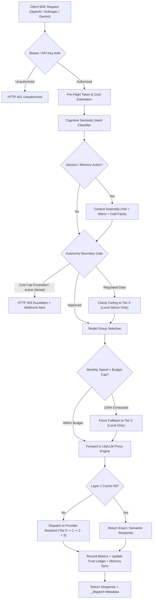

# DISPATCH

<div align="center">

**Enterprise-Grade Cost-Aware LLM Router · 4-Tier Capacity · 3-Layer Caching · Local-First Memory · Sovereign Control Plane**

[](LICENSE)
[](https://www.python.org/)
[](https://fastapi.tiangolo.com)
[](https://github.com/BerriAI/litellm)
[](docker-compose.yml)
[](config/prometheus.yml)
[](dispatcher/otel.py)

</div>

---

## Executive Summary

Enterprise AI adoption is constrained by a fundamental trilemma: **unpredictable cloud inference expenses**, **data sovereignty & regulatory compliance risks**, and **uncontrolled autonomous agent blast radius**. Frontier models ($15–$75/M tokens) are frequently squandered on deterministic or routine tasks, while sensitive corporate intellectual property and regulated PII/PHI risk cloud leakage.

**DISPATCH** is an open-source, production-grade LLM routing gateway and governance control plane. It operates transparently between your client applications (speaking native OpenAI, Anthropic, or Google Gemini wire formats) and backend inference providers, enforcing a strict **local-first, cost-optimized, and policy-governed execution model**:

* **70%–90% Cloud Spend Reduction (FinOps):** Automatically routes requests through a 4-tier cost escalation ladder—exhausting on-premise silicon ($0) and free API quotas ($0) before touching budget APIs (pennies/M tokens) or premium frontier models.
* **Provable Data Sovereignty (Zero Cloud Egress):** Built-in architectural control plane locks regulated or sensitive data to local hardware via hardware-enforced routing ceilings and cryptographic audit stamps.
* **Bayesian Agent Trust Governance:** A continuous Beta-distribution ledger dynamically scores autonomous agent reliability, tightening rate limits and requiring human approvals if anomalous behavior or policy violations occur.
* **Dynamic Pre-Flight Cost Guardrails:** Real-time token and USD cost estimation with automated fallback downgrades before requests reach cloud providers.
* **Cognitive Semantic Routing & Frontier Fleet:** Intent classification with confidence scoring across frontier models including **Claude 3.7 Sonnet**, **OpenAI o1 / o3-mini / GPT-4o**, **DeepSeek R1 / V3**, **Gemini 2.5 Pro / Flash**, and **Qwen 2.5 72B**.
* **Self-Healing Memory & Provenance:** Local-first episodic and semantic memory with automated contradiction detection, supersession, and 10M+ token hierarchical map-reduce compression at zero API cost.

---

## Architecture Overview

DISPATCH implements a strict **Control Plane / Data Plane separation**:

* **Control Plane (DISPATCH Gateway :8080):** Cognitive task classification, budget gating, residency tagging, autonomy boundary enforcement, Bayesian trust ledger updates, context assembly, memory contradiction detection, and document map-reduce compression.
* **Data Plane (LiteLLM Proxy :4000):** Connection pooling, provider protocol adapters, upstream failover, cooldowns, load balancing, prompt prefix caching, and raw token streaming.

```
┌─────────────────────────────────────────────────────────────────────────────────┐
│                  Enterprise Client Applications & Autonomous Agents             │
│        (OpenAI SDK  ·  Anthropic SDK  ·  Gemini SDK  ·  LangChain  ·  MCP)      │
└────────────────────────────────────────┬────────────────────────────────────────┘
                                         │ HTTP / REST
                                         ▼
┌─────────────────────────────────────────────────────────────────────────────────┐
│                       DISPATCH GATEWAY & CONTROL PLANE (:8080)                  │
│                                                                                 │
│   ┌───────────────────────┐  ┌───────────────────────┐  ┌───────────────────┐   │
│   │   Protocol Adapters   │  │ Cognitive Semantic    │  │ Autonomy Boundary │   │
│   │ (OpenAI/Claude/Gemini)│  │ Router & Cost Engine  │  │ (Sovereignty Gate)│   │
│   └───────────┬───────────┘  └───────────┬───────────┘  └─────────┬─────────┘   │
│               │                          │                        │             │
│   ┌───────────▼───────────┐  ┌───────────▼───────────┐  ┌─────────▼─────────┐   │
│   │ Multi-Tier Memory Hub │  │ Context Map-Reduce    │  │ Bayesian Trust    │   │
│   │ (Hot/Warm/Cold Store) │  │ (>1M Tok Local Pipeline│ │ Ledger (Beta Dist)│   │
│   └───────────────────────┘  └───────────────────────┘  └───────────────────┘   │
└────────────────────────────────────────┬────────────────────────────────────────┘
                                         │ Routed Request + Audit Header
                                         ▼
┌─────────────────────────────────────────────────────────────────────────────────┐
│                         LITELLM EXECUTION ENGINE (:4000)                        │
│         (Connection Pooling · Prompt Caching · Fallbacks · Rate Limiting)       │
└──────┬─────────────────────┬─────────────────────┬─────────────────────┬────────┘
       │                     │                     │                     │
       ▼                     ▼                     ▼                     ▼
 ┌───────────┐         ┌───────────┐         ┌───────────┐         ┌───────────┐
 │  TIER 0   │         │  TIER 1   │         │  TIER 2   │         │  TIER 3   │
 │   Local   │         │ Free API  │         │  Budget   │         │  Premium  │
 │ Hardware  │         │  Quotas   │         │ Cloud API │         │ Frontier  │
 │ (vLLM,    │         │ (Groq,    │         │(DeepSeek, │         │ (Claude   │
 │  Ollama,  │         │  Gemini   │         │ Flash,    │         │  3.7 /    │
 │LM Studio) │         │  Free,    │         │ Haiku,    │         │  o1 / o3, │
 │           │         │OpenRouter)│         │ o3-mini)  │         │  GPT-4o)  │
 │  $0 / tok │         │  $0 / tok │         │ pennies/M │         │ dollars/M │
 └───────────┘         └───────────┘         └───────────┘         └───────────┘
```



---

## Core Capabilities

### 1. The 4-Tier Cost Escalation Engine & Frontier Fleet

DISPATCH maps every incoming request into a deterministic tier hierarchy. Expensive providers are never called if a lower tier can satisfy the task requirements.

| Tier | Category | Backends & Models | Marginal Cost | Primary Use Case |
|---|---|---|---|---|
| **Tier 0** | **Local Hardware** | vLLM (Qwen2.5-Coder-7B), Ollama (Phi-4-mini, Qwen2.5:14B), LM Studio | **$0.00** | Code generation, embeddings, semantic cache lookups, document summarization, regulated PII/PHI |
| **Tier 1** | **Free API Quotas** | Groq (Llama-3.3-70B, Llama-3.1-8B), OpenRouter Free (Mistral-7B), Gemini Free (Flash-Lite 1M context) | **$0.00** | High-speed fast chat, burst capacity when local GPUs are saturated |
| **Tier 2** | **Budget Cloud APIs** | DeepSeek (V3 Chat, R1 Reasoner), Gemini 2.0/2.5 Flash, Claude 3.5 Haiku, OpenAI o3-mini, GPT-4o-mini, Qwen 2.5 72B | **~$0.07 – $1.00 / M tokens** | General reasoning, large context analysis, standard production workloads |
| **Tier 3** | **Premium Frontier** | Claude 3.7 Sonnet, OpenAI o1 / GPT-4o, Gemini 2.5 Pro, Claude 3 Opus | **~$1.25 – $15.00 / M tokens** | Complex architecture, mission-critical legal/financial analysis, audited code review |

* **Hard Monthly Cap:** When cumulative spend hits `MONTHLY_BUDGET_USD`, cloud routing automatically shuts down; all traffic degrades gracefully to Tier 0.
* **Daily Soft Limit:** When daily burn exceeds `DAILY_SOFT_LIMIT_USD`, Tier 2/3 APIs are temporarily gated for non-essential traffic.

---

### 2. 3-Layer Additive Caching

Caching layers are independent and compound their savings across consecutive calls:

1. **Layer 1 — Full Response Cache (Edge):**
   * Exact Match: Redis key-value cache keyed by SHA-256 of normalized messages.
   * Semantic Match: Qdrant vector index measuring cosine similarity ($\ge 0.92$) using local `nomic-embed-text` embeddings. Lookups cost $0.00 and execute in $<15\text{ms}$.
2. **Layer 2 — Provider KV Prompt Prefix Caching (Cloud):**
   * LiteLLM auto-injects `cache_control` breakpoints on system and contextual prompts for Claude (90% discount on cached reads).
   * Automatically leverages native prefix caching on DeepSeek (activates at 64 tokens), Gemini (75% discount), and OpenAI (50% discount).
3. **Layer 3 — Local vLLM Prefix Caching (Silicon):**
   * Server-side `--enable-prefix-caching` allows concurrent local agent sessions sharing common system prompts to reuse KV tensors directly in GPU VRAM.

---

### 3. Enterprise Autonomy Boundary & Sovereignty Control Plane

Configured via declarative YAML (`config/autonomy_boundary.yaml`), the autonomy boundary acts as an unbypassable gateway enforcing security and regulatory policies:

* **Data Residency & Sovereignty:** Every request is tagged with an immutable audit stamp (`audit_id`, `timestamp`, `residency`, `classification`).
* **Hardware Egress Ceilings:**
  * `regulated` (HIPAA / GDPR / PCI-DSS): **Tier 0 strictly enforced.** Prompts physically cannot leave local hardware.
  * `confidential`: Capped at Tier 2 (budget cloud).
  * `internal` / `public`: Allowed up to Tier 3.
* **Blast-Radius Mitigation:** Hard per-request cost caps (`max_cost_per_request_usd`) and maximum payload sizes (`max_documents_chars`).
* **Persistent Escalation Workflows:** Over-limit requests or unauthorized tier escalations produce structured audit records and HTTP 403 escalations.
* **Automated Webhook Dispatcher:** Asynchronously dispatches structured JSON payloads and Slack Mrkdwn alert blocks to `DISPATCH_WEBHOOK_URL` / `SLACK_WEBHOOK_URL` upon escalation creation and resolution.
* **Human-in-the-Loop Review:** Security administrators resolve pending escalations via `POST /boundary/escalations/{id}/verdict`, dynamically feeding decisions into the agent's Bayesian trust score.

---

### 4. Bayesian Agent Trust Ledger & Dynamic Rate Limiting

As autonomous agents execute tools and make LLM calls, static role-based access control proves insufficient. DISPATCH implements a **continuous Bayesian Trust Engine** using a Beta distribution $\text{Beta}(\alpha, \beta)$ per `agent_id`:

$$\text{Trust Score} = \frac{\alpha}{\alpha + \beta}, \quad \text{Confidence} = 1 - \frac{2}{\alpha + \beta}$$

* **Asymmetric Penalization:** Bad evidence is penalized heavily ($\text{Weight} = 3.0 - 6.0\times$) while good evidence accrues conservatively ($\text{Weight} = 1.0\times$). Trust is slow to earn and rapid to lose.
* **Exponential Half-Life Decay:** Evidence decays toward the neutral prior $(1.0, 1.0)$ with a 14-day half-life. Stale agents cannot rely on ancient good behavior.
* **Trust-Tier Dynamic Rate Limiting:** Sliding-window rate limiter enforces elastic RPM quotas based on real-time agent trust:
  * **Probation ($<0.40$):** Capped strictly at `10 RPM` to mitigate runaway tool loops or prompt injection; per-request cost cap slashed to $0.2\times$.
  * **Standard ($0.40–0.79$):** Baseline organizational limit of `60 RPM`.
  * **Trusted ($\ge 0.80$):** Expanded capacity up to `180 RPM`; cost cap widened up to $2.0\times$ (clamped strictly by `hard_max_cost_per_request_usd`).

> **Key Invariant:** Trust can only *narrow* or *expand* elasticity within what data classification permits. A maximally trusted agent **can never** route `regulated` data off on-premise hardware.

---

### 5. Cognitive & Semantic Task Router (Phase 3)

* **Zero-Shot Intent Classification:** Evaluates input prompts against a multi-archetype cognitive embedding and term-vector space (`coding`, `reasoning`, `math`, `long_context`, `multilingual`, `quality`, `fast_chat`, `governance`, `retrieval`, `general`).
* **Confidence & Justification Metrics:** Every routing decision outputs a normalized confidence score and human-interpretable routing justification attached to `_dispatch` metadata.
* **OpenRouter & Frontier Model Interoperability:** First-class support for OpenRouter routes and frontier models (**Claude 3.7 Sonnet**, **OpenAI o1 / o3-mini**, **DeepSeek R1 / V3**, **Qwen 2.5 72B**, **Llama 3.3 70B**, **Gemini 2.5 Pro**) with automatic enterprise headers (`HTTP-Referer`, `X-Title`).

---

### 6. Dynamic Pre-Flight Cost Engine & Budget Guardrails (Phase 3)

* **Pre-Flight Token & USD Cost Projections:** Exact estimation of input and bounded output tokens before initiating LiteLLM network calls.
* **Automated Blast-Radius Downgrades:** If a request's projected cost exceeds `max_cost_per_request_usd`, DISPATCH automatically identifies and substitutes an optimal, cost-effective fallback tier (e.g. `premium-openai` $\to$ `budget-openai` or `local-fast`), protecting monthly budgets from accidental overruns.
* **Cost Inspection Endpoint (`POST /dispatch/cost-estimate`):** Dry-run token volume, input/output cost breakdown, and free-tier qualification.

---

### 7. Local-First Memory Hierarchy & Self-Healing Contradiction Supersession (Phase 3)

* **Working Memory (Hot, 0ms):** In-process conversation turns for the active session.
* **Episodic Memory (Warm, ~50ms):** Persisted conversation turns in SQLite (WAL mode). On session closure, conversation summaries are embedded into Qdrant to retrieve historical session context.
* **Semantic Memory (Cold, ~200ms):** Durable facts (preferences, constraints, entities, skills) extracted in the background by a local model (`phi4-mini`) at $0.00$ cost. Retrieved via hybrid search: SQLite FTS5 (full-text keyword matching) $\cup$ Qdrant vector similarity.
* **Automated Contradiction Resolution:** Detects conflicting assertions or updated preferences (e.g., "dark mode" $\to$ "light mode") for an entity key. Superseded facts are automatically retired (`valid=0, superseded_by=<id>`) and logged in the `contradictions` audit table, while retaining complete historical lineage queryable via `GET /memory/facts/{id}/provenance`.
* **Context Map-Reduce Pipeline:** Ingests document corpora exceeding 10M+ tokens. Automatically chunks on paragraph boundaries, maps summaries in parallel across local models, and recursively reduces until the corpus fits the target model window.

---

### 8. Distributed Redis State Backplane (Phase 4)

* **Multi-Node Sliding-Window Rate Limiting:** High-throughput sorted set (`ZADD`, `ZREMRANGEBYSCORE`, `ZCARD`) atomic transactions across horizontally scaled DISPATCH clusters.
* **Zero-Downtime Hybrid Fallback:** If Redis experiences network partition or downtime, `HybridRateLimiter` seamlessly falls back to thread-safe in-memory sliding windows with zero dropped traffic.
* **Cross-Instance Trust Ledger Synchronization:** Real-time Redis Pub/Sub broadcast (`dispatch:events:trust`) propagates Bayesian trust updates across all cluster nodes.

---

### 9. Adaptive Contextual Bandit Router (Phase 4)

* **Thompson Sampling & $\epsilon$-Greedy Optimization:** Online multi-armed bandit routing algorithm maintaining Beta distributions $\text{Beta}(\alpha, \beta)$ per model candidate arm.
* **Multi-Objective Composite Reward Function:**
  $$R = \text{success} \times \left[ 0.40 \cdot (1 - \text{norm\_lat}) + 0.40 \cdot (1 - \text{norm\_cost}) + 0.20 \cdot \text{rating} \right] - (1 - \text{success}) \cdot \text{penalty}$$
* **Continuous Online Feedback:** Rewards are automatically computed on every completion and asynchronously tunable via `POST /dispatch/feedback`. Arm telemetry and expected value posteriors are queryable via `GET /dispatch/bandit/stats`.

---

### 10. Edge PII/PHI Redaction & Synthetic Token Masking (Phase 4)

* **Zero-Latency In-Memory Regex Engine (`PrivacyMask`):** Deterministic on-premise redaction scanning prompts for sensitive entities before cloud dispatch:
  * Authentication: API Keys (`sk-proj-*`, `AKIA*`, `ghp_*`), Bearer Tokens, JWTs.
  * Personal Identifiable Information: Emails, Phone Numbers, Social Security Numbers (SSN).
  * Financial & Network: Credit Card Numbers (Luhn-compliant patterns), IPv4 Addresses.
* **Deterministic Reversible Unmasking:** Synthetic tokens (`<MASK:EMAIL_1>`, `<MASK:API_KEY_1>`) are injected into the upstream payload, and original values are substituted back into the generated response before returning to the client. Regulated data remains physically isolated on premise.

---

## Client Integration & Wire Format Compatibility

DISPATCH features native edge adapters. Existing SDK clients point their `base_url` to DISPATCH without modifying application logic.

### 1. OpenAI SDK (Python & TypeScript)
```python
from openai import OpenAI

client = OpenAI(base_url="http://localhost:8080/v1", api_key="sk-dispatch-key")

response = client.chat.completions.create(
    model="auto",  # Cognitive task classification & tier routing
    messages=[{"role": "user", "content": "Implement distributed consensus in Rust"}],
    extra_body={
        "classification": "confidential",
        "agent_id": "backend-architect-bot",
        "session_id": "session-prod-88",
        "organization_id": "engineering-dept",
        "project_id": "core-infrastructure",
    }
)

print(response.choices[0].message.content)
print(response.model_extra["_dispatch"])
# Output: {'task': 'coding', 'model_group': 'local-fast', 'latency_ms': 412.3, ...}
```

### 2. Anthropic SDK (`/v1/messages`)
```python
from anthropic import Anthropic

client = Anthropic(base_url="http://localhost:8080", api_key="sk-dispatch-key")

response = client.messages.create(
    model="claude-3.7-sonnet",  # Maps directly to Tier 3 premium-balanced
    max_tokens=1024,
    messages=[{"role": "user", "content": "Review this cryptographic protocol"}],
)

print(response.content[0].text)
```

### 3. Google Gemini SDK (`generateContent`)
```python
from google import genai

client = genai.Client(
    api_key="sk-dispatch-key",
    http_options={"base_url": "http://localhost:8080"}
)

response = client.models.generate_content(
    model="gemini-2.5-pro",  # Maps directly to premium-gemini
    contents="Analyze systemic risks in this liquidity pool",
)

print(response.text)
```

### 4. Model Context Protocol (MCP) Server
Integrate DISPATCH as a native tool suite inside **Claude Code** or **Claude Desktop**:

```bash
# Add to Claude Code
claude mcp add dispatch -- python dispatcher/mcp_server.py
```

Exposes native tools:
* `dispatch_infer`: Governed inference with data classification tags.
* `dispatch_route_preview`: Zero-execution dry run showing classification and tier fallback.
* `dispatch_status`: Real-time cluster spend, tier health, and memory stats.
* `dispatch_memory_search`: Semantic search over historical facts and corporate memory.
* `dispatch_boundary_policy`: Inspect active security limits and pending escalations.

---

## Quick Start & Deployment

### Prerequisites
* Docker Engine 24.0+ and Docker Compose v2.20+
* (Optional) Local inference node running vLLM, Ollama, or LM Studio

### 1. Clone & Configure
```bash
git clone https://github.com/hoomanp/dispatch.git
cd dispatch

# Copy environment variables
cp .env.example .env

# Edit .env and supply available API keys (all keys are strictly optional)
# Set DISPATCH_API_KEY to secure your gateway port 8080
```

### 2. Start the Cluster
```bash
# Start core services (DISPATCH Gateway, LiteLLM, Redis, Qdrant, Postgres)
docker compose up -d

# Verify health
curl -f http://localhost:8080/health
```

### 3. Run with Full Observability Profile
```bash
# Spawns Prometheus (:9090), Grafana (:3001), and Jaeger Tracing (:16686)
docker compose --profile observability up -d
```

* **Grafana Dashboard:** `http://localhost:3001` (Default credentials: `admin` / `dispatch`)
* **LiteLLM Admin UI:** `http://localhost:4000/ui` (Master key: `LITELLM_MASTER_KEY`)
* **Prometheus Metrics:** `http://localhost:9090`
* **Jaeger Distributed Tracing:** `http://localhost:16686`

---

## API Reference

| Method | Endpoint | Description |
|---|---|---|
| `POST` | `/v1/chat/completions` | OpenAI-compatible chat completion (streaming supported, automatic PII masking & bandit reward learning). |
| `POST` | `/v1/embeddings` | Embeddings endpoint (routed to Tier 0 `local-embed`). |
| `POST` | `/v1/messages` | Anthropic Messages API protocol adapter. |
| `POST` | `/v1beta/models/{model}:generateContent` | Google Gemini API protocol adapter. |
| `POST` | `/v1/sessions` | Create a stateful memory session with optional title. |
| `DELETE` | `/v1/sessions/{id}` | Close session; triggers asynchronous local fact extraction. |
| `POST` | `/dispatch/classify` | Cognitive routing explanation (task classification, confidence & cost estimate). |
| `POST` | `/dispatch/cost-estimate` | Pre-flight token and USD cost estimation with downgrade recommendation. |
| `POST` | `/dispatch/feedback` | Online feedback hook for the Adaptive Contextual Bandit Router. |
| `GET` | `/dispatch/bandit/stats` | Real-time multi-armed bandit arm posteriors and performance metrics. |
| `GET` | `/dispatch/tiers` | Health, spend status, and gating state across Tiers 0–3. |
| `GET` | `/trust/{agent_id}` | Bayesian trust snapshot, confidence, and audit trail for an agent. |
| `GET` | `/trust` | Global trust leaderboard sorted by recent activity. |
| `POST` | `/trust/{agent_id}/event` | Ingest external verdict (`eval_pass`, `eval_fail`, `human_approve`, `human_reject`). |
| `GET` | `/boundary/policy` | Inspect active autonomy boundary rules and classification ceilings. |
| `GET` | `/boundary/escalations` | List escalation records (supports `?status=pending` or `?status=approved`). |
| `POST` | `/boundary/escalations/{id}/verdict` | Review and resolve a pending escalation (`approved` or `rejected`) with Bayesian trust update. |
| `GET` | `/memory/stats` | Memory engine metrics across hot, warm, and cold tiers. |
| `GET` | `/memory/facts` | List active semantic facts (supports `?category=` and `?include_superseded=true`). |
| `GET` | `/memory/facts/{id}/provenance` | Retrieve fact lineage, supersessions, and contradiction events. |
| `GET` | `/memory/contradictions` | List history of detected memory contradictions and updates. |
| `POST` | `/memory/search` | Search semantic memory using hybrid FTS5 and vector retrieval. |
| `POST` | `/context/preview` | Preview hierarchical map-reduce compression plan for massive docs. |
| `GET` | `/metrics` | Prometheus metrics scrape endpoint. |
| `GET` | `/health` | Container liveness and readiness probe. |

---

## Observability & Telemetry

### Prometheus Metrics Catalog

| Metric | Type | Labels | Description |
|---|---|---|---|
| `dispatch_requests_total` | Counter | `task`, `model_group`, `tier`, `outcome` | Total requests processed by routing decision and outcome (`ok`, `denied`). |
| `dispatch_request_seconds` | Histogram | `model_group` | End-to-end request latency distributions in seconds. |
| `dispatch_tokens_total` | Counter | `model_group`, `direction` | Token consumption volume partitioned by `input` and `output`. |
| `dispatch_monthly_spend_usd` | Gauge | — | Current cumulative cloud spend for the monthly accounting cycle. |
| `dispatch_monthly_budget_usd` | Gauge | — | Hard monthly expenditure limit. |
| `dispatch_boundary_denials_total`| Counter | `action`, `reason` | Security boundary denials and policy escalations triggered. |
| `dispatch_rate_limit_throttles_total` | Counter | `agent_id` | Sliding-window rate limit throttles partitioned by agent. |
| `dispatch_pii_redactions_total` | Counter | `entity_type` | Total sensitive entity synthetic token redactions before cloud dispatch. |
| `dispatch_bandit_reward` | Histogram | `model_group` | Multi-armed bandit reward distribution per model arm. |
| `dispatch_agent_trust_score` | Gauge | `agent_id` | Real-time Bayesian trust score ($0.0 – 1.0$) per active agent. |
| `dispatch_memory_facts` | Gauge | — | Total verified semantic facts stored in cold memory. |
| `dispatch_memory_sessions` | Gauge | — | Total episodic sessions indexed. |

### Distributed Tracing (OpenTelemetry)
Set `OTEL_EXPORTER_OTLP_ENDPOINT=http://jaeger:4318/v1/traces` to capture end-to-end distributed traces. Requests carry W3C trace contexts through DISPATCH $\to$ LiteLLM $\to$ Upstream Provider, automatically annotated with `dispatch.task`, `dispatch.model_group`, `dispatch.tier`, and `dispatch.audit_id`.

---

## Continuous Evaluation & Regression Harness

DISPATCH includes an enterprise evaluation & benchmarking harness (`evals/harness.py`):

```bash
# CI-safe routing & sovereignty benchmark (no external providers needed)
python evals/harness.py --routing-only

# Full multi-dimensional evaluation with Markdown report generation
python evals/harness.py --base-url http://localhost:8080 --threshold 0.85 --report evals/results/report.md
```

Evaluation checks cover:
* **Route Conformance:** Validates cognitive task classification and model group selection.
* **Sovereignty Boundary:** Verifies hardware isolation for `regulated` and `confidential` classifications.
* **Dynamic Pre-Flight Cost:** Verifies token and USD budget cap enforcement.
* **Response Quality:** Substring and assertion checking against live backends.

Results append to `evals/results/history.jsonl` and output formatted executive summaries to `evals/results/report.md`.

---

## Strategic Comparison (FIDPSTVH Framework)

| Dimension | Managed Gateway (OpenRouter) | LLM Proxy (LiteLLM Standalone) | Enterprise Router (DISPATCH) |
|---|---|---|---|
| **F**unctionality | Unified API, price floors, provider fallback | Load balancing, retries, 100+ providers | Cognitive 4-tier routing, self-healing memory, >10M token map-reduce, Bayesian trust governance |
| **I**ntegration | OpenAI wire format | OpenAI, Anthropic | OpenAI, Anthropic, Gemini, LangChain, MCP native tool server |
| **D**ata Sovereignty | Data policies available, but prompts transit third-party infrastructure | Depends on hosting | Hard on-premise boundary: `regulated` classification physically cannot reach a cloud provider |
| **P**rivacy | Vendor zero-data retention policies | Self-hosted data plane | 100% local memory extraction ($0.00 cost); sovereign audit trail retained entirely on-premise |
| **S**ecurity | Cloud provider trust boundary | Standard bearer token | Control-plane isolation: residency tagging, blast-radius caps, human-in-the-loop escalations |
| **T**CO | Gateway fee (~5.5% credit mark-up) | Direct provider cost | **Lowest TCO:** $0 marginal compute on local GPUs + free quota harvesting before cloud escalation |
| **V**endor Lock-In | High dependence on gateway routing | Minimal | Zero. Open-source MIT. Upstream providers configured via standard YAML |
| **H**osting | Fully managed SaaS | Docker / Self-hosted | Turnkey Docker Compose topology with integrated observability stack |

---

## Executive Engineering Roadmap

* [x] **Phase 1: Architecture & Reliability Hardening (v1.1.0)**
  * Asynchronous connection pooling via shared `httpx.AsyncClient` lifecycle.
  * SQLite WAL mode concurrency safeguards with 30s busy timeouts and transactional guarantees.
  * 64-bit point hashing in Qdrant to eliminate vector collision risks.
  * Native protocol edge adapters for Anthropic and Gemini SDKs.
* [x] **Phase 2: Enterprise Cluster & Governance (v1.2.0)**
  * Sliding-window rate limiting per `agent_id` with dynamic trust tier throttling (Probation 10 RPM, Standard 60 RPM, Trusted 180 RPM).
  * Persistent escalation storage with full lifecycle tracking (`pending`, `approved`, `rejected`).
  * Interactive escalation resolution endpoint (`POST /boundary/escalations/{id}/verdict`) with automated Bayesian trust updates.
  * Multi-tenant organization and project tagging (`organization_id`, `project_id`).
  * Webhook and Slack notification dispatcher for security review.
* [x] **Phase 3: Cognitive Routing & Self-Healing Memory (v1.3.0)**
  * Cognitive zero-shot semantic intent classifier and task router (`dispatcher/semantic_router.py`).
  * Dynamic pre-flight cost estimation and budget guardrails (`dispatcher/cost_engine.py`).
  * Automated memory contradiction detection, supersession, and provenance tracking (`dispatcher/memory_engine.py`).
  * OpenRouter & frontier model provider configurations (Claude 3.7 Sonnet, OpenAI o1/o3-mini, DeepSeek R1/V3, Qwen 2.5 72B, Llama 3.3 70B, Gemini 2.5 Pro).
  * Multi-dimensional evaluation harness with automated Markdown reporting (`evals/harness.py`).
* [x] **Phase 4: Distributed State, Contextual Bandits & Edge Privacy (v1.4.0)**
  * Distributed Redis backplane with high-throughput sliding window rate limiting and Pub/Sub trust synchronization.
  * Adaptive contextual multi-armed bandit optimizer (Thompson Sampling + $\epsilon$-Greedy exploration) with online reward loops.
  * Edge PII/PHI redaction engine with deterministic reversible unmasking and zero-latency token protection.

---

## License

This project is licensed under the **MIT License** — see the [LICENSE](LICENSE) file for details.

